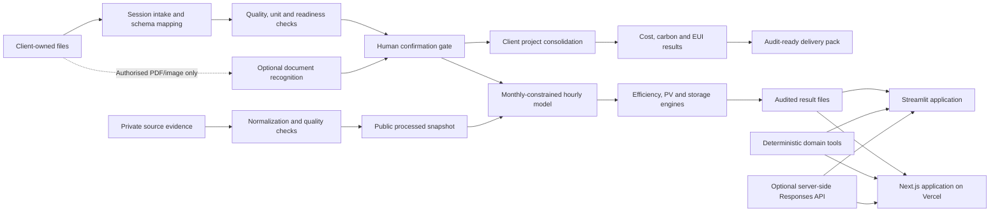

# Technical Architecture

**Team:** EnerGen AI
**Project:** Irene
**Track:** T1 — AI for Clean Energy

Validated on a Ningbo reference case; designed for configurable deployment in Malaysia, pending local pilot validation.

## System flow

## Components

| Layer | Implementation | Responsibility |
| --- | --- | --- |
| Data preparation | Python, pandas | Normalize evidence, detect meter anomalies and assign evidence classes |
| Temporal model | scikit-learn candidate plus transparent calendar baseline | Select a normalized reference shape through a time-based holdout gate |
| Reconciliation | Python | Constrain public hourly estimates to approved aggregate monthly building and PV totals |
| Efficiency screening | Deterministic engineering rules | Calculate HVAC, lighting, operations and combined P10/P50/P90 cases |
| Storage dispatch | SciPy linear programming | Compare future loss-aware dispatch with the rule-based comparator |
| Analysis tools | Python and TypeScript implementations | Answer project questions with traceable inputs and recalculations |
| Local interface | Streamlit | Explore evidence, scenarios, charts and the analysis engine |
| Hosted interface | Next.js on Vercel | Provide the public competition experience and server API route |
| Optional orchestration | OpenAI Responses API | Select project tools and compose an answer; never supplies project values |
| Client intake | Python and browser TypeScript | Parse structured data, documents and BIM/CAD without persisting raw uploads |
| Admission control | Mapping record and reviewer confirmation | Keep unreviewed fields and facts outside the client-specific model |
| Client project analysis | Deterministic Python and TypeScript implementations | Consolidate confirmed tables, resolve register deltas, label inputs and calculate reporting-period energy, cost, carbon and EUI |
| Client delivery pack | In-memory ZIP export | Provide mappings, quality, results, source fingerprints and audit events without raw uploads |
| Optional document recognition | Server-side Responses API | Extract strict PDF/image facts after per-file consent with `store: false` |

## Model-selection gate

The gradient-boosting candidate is evaluated against a weekday/weekend-hour calendar prior on a time-based holdout set. The candidate is rejected when it does not improve the transparent baseline. In the included run, the calendar prior is selected with a normalized shape MAE of 14.36%.

This validation concerns reference-profile shape only. It is not evidence of case-building hourly accuracy.

## Runtime boundaries

- Streamlit can run entirely offline from the files in this repository.
- The web client also includes the same deterministic local analysis engine.
- Optional model calls occur only from server code. The deployment secret is never bundled into client JavaScript or returned by the status route.
- If provider access is unavailable, the interface automatically returns to local analysis.
- Client-file parsing is session-only by default; optional recognition accepts authorised PDF/image content only.
- Only confirmed files and included tables reach client-project calculations; short coverage is not silently annualised.
- Client delivery packs exclude raw uploads and raw table rows.
- Native DWG requires a verified conversion route and is never presented as parsed when that route is unavailable.
- Neither interface connects to or controls a building management system.

## Deployment and commercial layers

| Layer | Customer outcome | Commercial form |
| --- | --- | --- |
| File-based diagnosis | Confirmed baseline, auditable report and action shortlist | One-off diagnosis fee |
| Calibrated pilot | Temporary metering, model calibration and savings verification | Implementation and M&V service fee |
| Portfolio service | Governed multi-site analytics and benchmarking | Annual subscription |

Target customers are commercial buildings, campuses, industrial parks and energy service companies (ESCOs). The pilot sequence is file audit → temporary metering → calibration → savings verification → multi-site scale.
